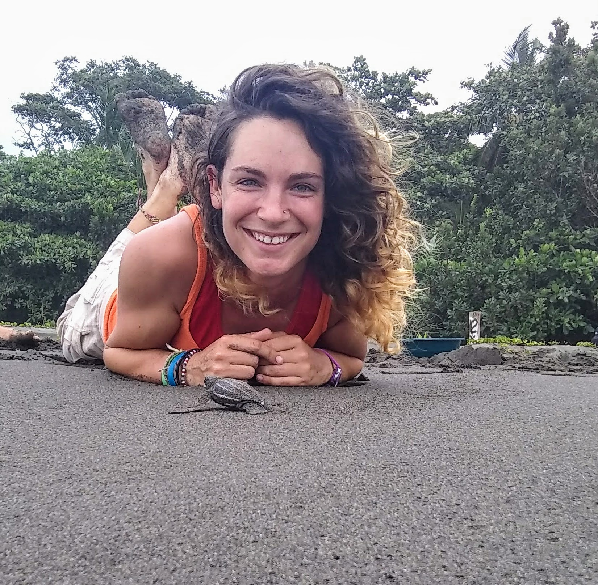

```{r setup, include=FALSE}
knitr::opts_chunk$set(echo = TRUE)
```

{width=50%}

# **Nicole Barbour**

## *Ph.D. Candidate in Ecological Systems*

<font size= "4">(**Full CV upon request**)</font>

<font size="5"> I am a movement and spatial ecologist that specializes in marine systems and quantitative methods. I am currently a 4th year Ph.D. candidate in the **Bailey lab at the University of Maryland Center for Environmental Science** ([link](https://www.umces.edu/helen-bailey)) and the **Fagan lab at the University of Maryland College Park** ([link](http://science.umd.edu/biology/faganlab/index.html)). 

  My dissertation focuses on the movement ecology of sea turtles through different life stages. In addition to my dissertation research, I have a strong interest in citizen science, science outreach & STEM education initiatives, and interdisciplinary collaborations that bridge social and natural sciences. </font>
  
## **Contact Me:** 
<nbarbour@csumb.edu>
<nbarbour@umd.edu>
<nbarbour@umces.edu>

### **Linked In**: [link](https://www.linkedin.com/in/nicole-barbour-970589168/)
### **Google Scholar**: [link](https://scholar.google.com/citations?user=XolPQ8cAAAAJ&hl=en)
### **GitHub**: [link](https://github.com/barb3800)


