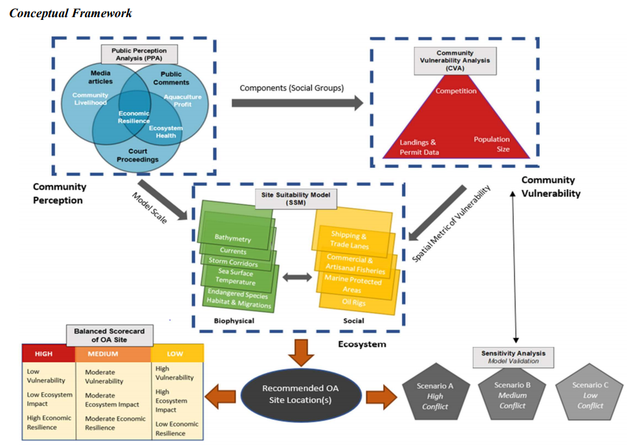
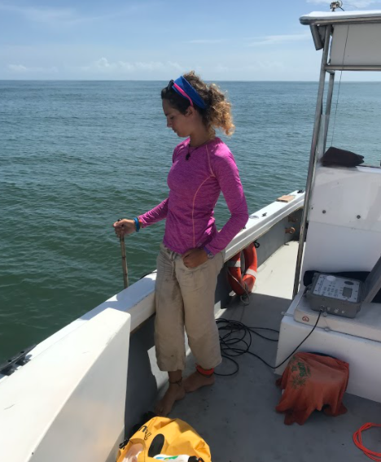

```{r setup, include=FALSE}
knitr::opts_chunk$set(echo = TRUE)
```


### *Below is a list of the research and education projects I am currently or have recently been working on, including my dissertation research and external appointments.*
<br>

### **SESYNC Graduate Pursuit Interdisciplinary Research Project: A Socio-Environmental Approach to Improve Offshore Aquaculture and Policy in the Gulf of Mexico**

{width=75%}

  **Link to project**: [link](https://www.sesync.org/project/graduate-pursuits-request-for-proposals/a-socio-environmental-approach-to-improve-offshore)
  
  I am on a team of graduate women scientists from around the U.S. that are using a dynamic framework with multidisciplinary datasets (publicly available news articles, policy documents, public comments, fish landings data, biotic and abiotic offshore spatial layers, community vulnerability metrics) to inform the siting of finfish aquaculture farms in the offshore waters in the Gulf of Mexico and the impact of these sitings on public perceptions and community vulnerability for adjacent coastal regions.
  
<br>
  
### **Dissertation Research at the University of Maryland: Movement and Spatial Ecology of Sea Turtles in the Pacific and Atlantic Oceans**
  Link to **Upwell Turtles** website, my collaborator and funder: [link](https://www.upwell.org/)
  
  {width=50%}
  
  + ##### Chapter 1 (**published**): *Environmental and Biological Factors Influencing Dispersal of Neonate Leatherback Turtles from an Endangered Costa Rican Nesting Population*. 
  This chapter is completed and used a combination of empirical biologging methods and quantitative models (first passage time, random walk models, generalized additive mixed models) to characterize the movements and dispersal trajectories for neonate leatherback sea turtles in 2016 and 2018 in Pacuare, Costa Rica. My results show that despite a constant mean swimming speed at the population level, in fast ocean current conditions individual neonates demonstrate behavioral variability in response that may either result in advection with the currents and/or increased energy expenditure. These results have application for future biologging studies for this vulnerable life stage in different species and inform conservation efforts for this endangered subpopulation in the Atlantic.
  + ##### Chapter 2: *Tracking Multiple Life-Stages of Sea Turtles to Determine Ontogenetic Differences in Movement and Habitat Use*. 
  This research will be conducted in the summer of 2021, where will use novel miniature satellite tags on captive-reared juvenile green sea turtles from multiple age-classes (4 mo. and 1 yr) in the Cayman Islands to determine age-specific differences in swimming ability, habitat association, and navigation. The empirical methods utilizing tags will be complimented by biophysical models of movement in relationship to environmental covariates, behavioral segmentation methods, and ocean current models. These results will be innovative in providing some of the first long-term empirical tracks for these age-classes and for captive-raised individuals, which may inform conservation efforts and knowledge on their navigational abilities.
  + ##### Chapter 3: *Quantifying Vertical and Horizontal Movement Behaviors for Leatherback Turtles in the South Eastern Pacific*. 
  This research is currently ongoing and is utilizing a previously published large dataset of female leatherback migratory movements in the Eastern Pacific (see Shillinger et al. 2008, PLoS Biology) in combination with different movement behavior segmentation methods (e.g. first passage time, change point analysis) and advanced movement models (e.g. state space models, correlated velocity movement models) to incorporate both horizontal and vertical (e.g. diving behavior variables) movements in predicting different behavioral modes for migratory sea turtles. Behavioral modes will be partnered with statistical models with environmental covariates to provide a more thorough characterization of leatherback habitat use in the Eastern Pacific.
  
<br>
  
### **Plastic Pollution Outreach and Education Projects**


{width=50%}


  + ##### *Wave of Plastic*: 
  This is a project sponsored by NOAA Bay Watershed Education and Training (B-WET) that developed and provides a middle-school curricular unit on issues, characteristics, and impacts of plastic pollution. I edited the lesson curricula for this project and created website and social media material.
  
  **Website Link**: [Link](https://www.umces.edu/waveofplastic)
  
  
  + ##### *Plastic Watch*: 
  This project was sponsored by NOAA and Maryland DNR to partner with local restaurants in Solomons, MD, to create a framework to help these businesses reduce their plastic waste while prioritizing their business and expenditures. These efforts were complimented by outreach and education efforts in the community. My role on this project was the lead assistant and outreach coordinator and I created website and social media content, interviewed our business partners, conducted the final cost and usage analysis, drafted the final report, and found, distributed, and budgeted biodegradable products to replace plastic ones for these businesses.
  
  **Website Link**: [Link](https://www.umces.edu/PlasticWatch)
  
<br>

### **500 Women Scientists (Silver Spring) Website Design Team and Member** 

{width=50%}

  500 Women Scientists is an organization that promotes diversity, connection, and accessibility for scientists in defiance of racism and the patriarchy. I am proud to be a member of the Silver Spring Pod, where myself and a handful of other members are working to create a website for the Silver Spring Pod using GitPages (similar to this website!) that is free and easily modified for future members.
  
  **500WS Website Link**: [Link](https://500womenscientists.org/)

<br>

### **University of Maryland Graduate Student Government and Sustainability Council Graduate Representative** 

{width=50%}

  I am currently a graduate representative for the MEES (Marine-Estuarine Environmental Sciences) Graduate Program at the University of Maryland, where I serve on both the Graduate Student Government ([link](https://www.gsgumd.org/)) Local and Civic Engagement Committee and University Sustainability Council ([link](https://sustainability.umd.edu/about/sustainability-council)). With these roles, I get to represent my program constituents at the University government level, work on engaging graduate students with local and civic affairs, and assist the University in carrying out its Climate Action Plan.
  
<br>

### **Using Ecolabeling to Improve Crop Profiles, Public Perception, and Farm Profits for Shellfish Aquaculture** 

{width=75%}

  This project is a collaboration at the University of Maryland Center for Environmental Science, where we created an opinion piece on the importance of ecolabeling for shellfish, which have not had the extensive labeling and thus public awareness of ecosystem services and gear tradeoffs that other marketed seafood products have. This paper is currently under review at the Journal of Aquaculture Environment Interactions.