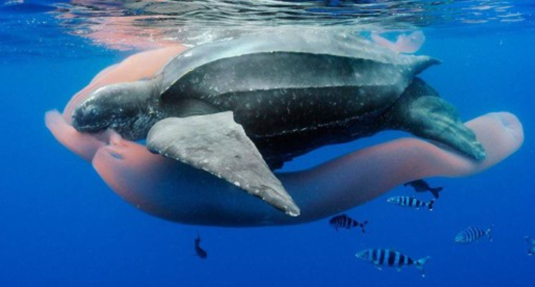
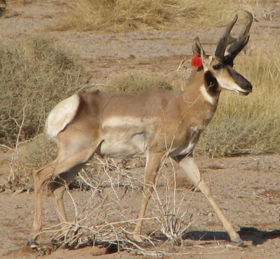
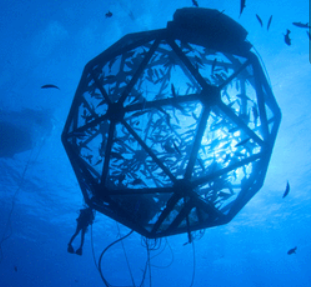

```{r setup, include=FALSE}
knitr::opts_chunk$set(echo = TRUE)
```


### *Below is a list of the research and education projects I am currently or have recently been working on, including my dissertation research and external appointments.*
<br>

  
### **Dissertation Research at the University of Maryland: Movement and Spatial Ecology of Sea Turtles in the Pacific and Atlantic Oceans**
  Link to **Upwell Turtles** website, my collaborator and funder: [link](https://www.upwell.org/)
  
  {width=50%} <br> {width=50%}
  
  + ##### Chapter 1 (**published**): *Environmental and Biological Factors Influencing Dispersal of Neonate Leatherback Turtles from an Endangered Costa Rican Nesting Population*. 
  This chapter used a combination of empirical biologging methods and quantitative models (first passage time, random walk models, generalized additive mixed models) to characterize the movements and dispersal trajectories for acoustically tracked, neonate leatherback sea turtles (2016, 2018) in Pacuare, Costa Rica. Results showed that despite a constant mean swimming speed across individuals, in fast ocean current conditions, individual neonates demonstrated behavioral variability in their swimming responses. These results have application for future biologging studies for this vulnerable life stage in different species and inform conservation efforts for this endangered subpopulation in the Atlantic.
  <br>
  + ##### Chapter 2 (**in progress**): *The Influence of Age Class, Ocean Currents, and Habitat on Juvenile Dispersal of the Caribbean Green Sea Turtle*. 
  This research is ongoing, in collaboration with the Cayman Turtle Centre ([link](https://www.turtle.ky/)) and Upwell ([link](https://www.upwell.org/news/2022/2/23/update-from-the-field-juvenile-green-sea-turtle-tagging-in-the-cayman-islands)). In January (2022), we deployed novel miniature satellite tags on three age classes of captive-reared, juvenile green sea turtles in the Cayman Islands. Preliminary results from this work show that ocean currents are the primary drivers of dispersal and trajectory variability, irrespective of other habitat variables and age class. An additional age class will be tagged and released in July (2022) and we expect these results to not only be informative for understanding early dispersal of sea turtles but also has implications for future conservation efforts, including headstarting programs.
  <br>
  + ##### Chapter 3 (**in review**): *Using Machine Learning Approaches to Classify Vertical Movement Profiles and Behavior *. 
  This research utilized dive profiles from a previously published large dataset of female leatherback migratory movements in the Eastern Pacific (see Shillinger et al. 2008, PLoS Biology) to develop novel methods of vertical behavior classification. A dynamic time warp (DTW) clustering analysis in combination with Generalized Additive Mixed Models (GAMMs) was used to identify two ecologically significant dive types for this population. An additional machine learning analysis using a convolutional neural network (CNN) model allowed us to further classify dive profiles within each of these dive types by their unique shape. This work has application for other species with vertical movement behaviors (e.g., flying, arboreal, aquatic species). Upon publication, an online tool will be published that will allow users to upload images of their own sea turtles dive profiles and use our CNN to classify these by standard dive shape.   
<br>
+ ##### Chapter 4 (**submitted**): *Incorporating multidimensional behavior into a dynamic management tool for a critically endangered and migratory species*. 
  This research builds on the work of Chapter 3, using the same dataset of migratory female leatherback tracks (Shillinger et al. 2008) and annotating daily locations of each individual by their proportion of each dive type from the DTW analysis. Annotated tracks were used in combination with fishing effort data (Global Fishing Watch,[link](https://globalfishingwatch.org/)) and 3D Utilization Dsitributions (UDs) to create a method for integrating multidimensional behavior and space use with threat data to produce a Dynamic Management (DM) tool. The results of this work are being added to South Pacific TurtleWatch ([link](https://www.upwell.org/sptw)), an existing DM tool for the Eastern Pacific population of leatherbacks. To determine multidimensional behaviors, We developed a new Hidden Markov Model (HMM) in Stan language (https://mc-stan.org/) and with an R interface that efficiently predicted 3 hidden states of movement for this population that differ in their horizontal/vertical movement parameters and spatial-temporal distribution. Upon publication, our methods, example code, and example data will become available as a public repository on GitHub.
  
<br>

### **Department of Defense Student Contractor Position: Understanding and Predicting Endangered Sonoran Pronghorn Habitat Use and Temoral Patterns on Military Bombing** (*manuscript in prep*)

{width=75%}

 This project uses a massive and long-running dataset of both observational and radio-collared data of endangered Sonoran pronhorn to understand their movement ecology and spatial-temporal use of the Barry M. Goldwater Range (BMGR) in Arizona (for information, [link](https://www.aetc.af.mil/News/Article-Display/Article/261238/sonoran-pronghorn-continue-to-thrive/)). A mixture of methods are used for this, including survival curves, continuous time movement models and individual area-corrected autocorrelated kernel density estimates of home ranges (see the CTMM R package, https://cran.r-project.org/web/packages/ctmm/ctmm.pdf), resource selection functions (RSFs), group size and composition generalized additive models (GAMs), and behavioral change point analyses (see the bcpa R package, https://cran.r-project.org/web/packages/bcpa/vignettes/bcpa.pdf).

<br>

### **NSF and SESYNC Graduate Pursuit: Assessing Socio-Environmental Suitability and Social License of Proposed Offshore Aquaculture Development: A Florida Case Study** (*manuscript submitted*)

{width=75%}
  
  This work stemmed from an interdisplinary collaboration of graduate women scientists from around the U.S. (including myself), with the aim of producing a dynamic framework to inform the development of offshore aquaculture in the U.S. Our approach utilized a combination of biological, social, and community publically-available data to assess community concerns, socioeconomic vulnerability, and socio-ecological feasibility of offshore aquaculture development. Our methods included mapping publicly available data for relevant social, ecological, and technical factors and analyzing public comments and media articles. As a timely and relevant case study, we applied these methods to a recent proposed federal permit for a pilot finfish farm project off the Florida Gulf coast (for information, [link](http://ocean-era.com/blog/2017/11/2/velella-epsilon-pioneering-offshore-aquaculture-in-the-gulf-of-mexico)) and for two viable finfish species for this region, red drum (Sciaenops ocellatus) and almaco jack (Seriola rivoliana). This work exemplifies how socio-environmental synthesis and data can be used to inform relevant social issues.
  
<br>

  
### **Plastic Pollution Outreach and Education Projects**


{width=50%}


  + ##### *Wave of Plastic*: 
  This is a project sponsored by NOAA Bay Watershed Education and Training (B-WET) that developed and provides a middle-school curricular unit on issues, characteristics, and impacts of plastic pollution. I edited the lesson curricula for this project and created website and social media material.
  
  **Website Link**: [Link](https://www.umces.edu/waveofplastic)
  
  
  + ##### *Plastic Watch*: 
  This project was sponsored by NOAA and Maryland DNR to partner with local restaurants in Solomons, MD, to create a framework to help these businesses reduce their plastic waste while prioritizing their business and expenditures. These efforts were complimented by outreach and education efforts in the local community. My role on this project was the lead assistant and outreach coordinator and I created website and social media content, interviewed our business partners, conducted the final cost and usage analysis, drafted the final report, and found, distributed, and budgeted biodegradable products to replace unsustainable plastic products for these businesses.
  
  **Website Link**: [Link](https://www.umces.edu/PlasticWatch)

<br>

### **University of Maryland Graduate Student Government and Sustainability Council Representative** 

{width=50%}

I served as a representative for the University of Maryland Graduate Student Government ([link](https://www.gsgumd.org/)) on both the Local and Civic Engagement Committee and the University Sustainability Council ([link](https://sustainability.umd.edu/about/sustainability-council)). With these roles, I was able to represent my constituents in the MEES (Marine-Estuarine Environmental Sciences) program at the University government level and engage both graduate students and local communities with local and civic affairs and actions. As the graduate Sustainability Council Representative for the University of Maryland, I was able to assist the University in carrying out its Climate Action Plan (for information, [Link](https://sustainingprogress.umd.edu/progress-commitments/climate-action-plan)).
  
<br>

### **Using Ecolabeling to Improve Crop Profiles, Public Perception, and Farm Profits for Shellfish Aquaculture** (*published*)

{width=75%}

  This project was a collaboration at the University of Maryland Center for Environmental Science (UMCES). We created an opinion piece on the importance of ecolabeling for shellfish, which have not had the extensive labeling and public awareness of ecosystem services that other marketed seafood products have.
  
### **Other Collaborations and Work**

In addition to those above, I have worked with the following organizations in STEM education and public outreach. I am always looking for new opportunities!

{width=50%} {width=50%} 

{width=50%} {width=50%} 

+ ##### Northstar Tutoring (website:[link]()): tutoring and mentorship services for K-12 students from underrepresented communities 
<br>
+ ##### 500 Woman Scientists (website:[Link](https://500womenscientists.org/)): organization that promotes diversity, connection, and accessibility for scientists in defiance of racism and the patriarchy
<br>
+ ##### Skype a Scientist (website:[Link](https://www.skypeascientist.com/)): connects scientists with public and private school classrooms and education organizations
<br>
+ ##### 500 Queer Scientists (website:[Link](https://500queerscientists.com/)): visibility campaign and platform for queer representation and voices in science

<br>