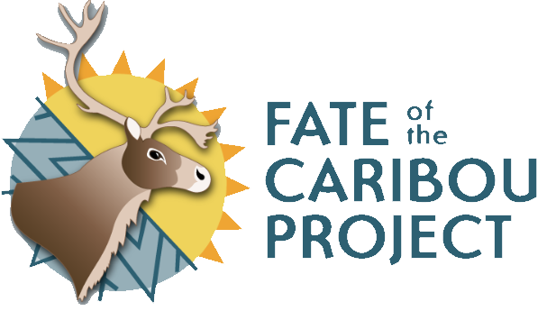
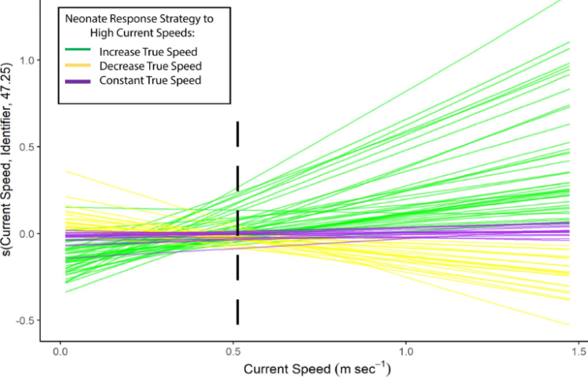
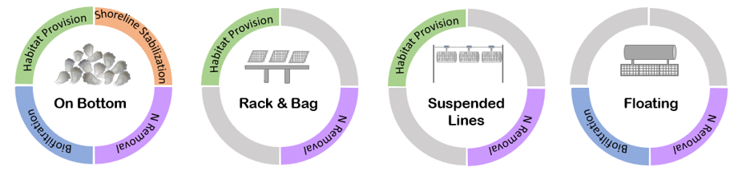
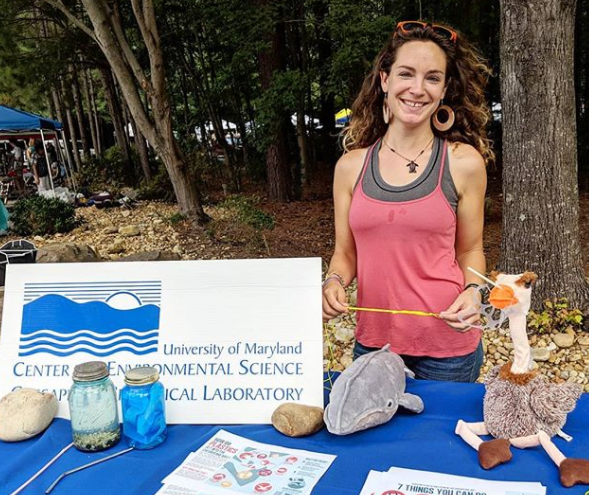
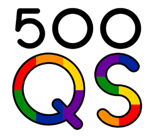

```{r setup, include=FALSE}
knitr::opts_chunk$set(echo = TRUE)
```


### *Below are some recent projects of mine, including my dissertation work and external projects.*
<br>

### **Postdoctoral Research (SUNY College of Environmental Science and Forestry): Quantifying Road Permeability for Migratory Caribou (Paper in Prep)**

{width=50%}

Currently, through the [Fate of the Caribou Project](https://fateofthecaribou.github.io/) and a contracted partnership with the Government of the Northwest Territories, I am working to develop and apply a tool for quantifying how strong of a deterrent linear barriers (e.g., roads) are to migratory species, such as boreal (*Rangifer tarandus caribou*) and barren-ground (*Rangifer tarandus groenlandicus*) caribou in the Northwest 
Territories (NWT). Caribou in this region are considered "threatened" under the NWT Species at Risk Act and are known to encounter and avoid roads, which experience variable traffic and deter animal crossings during their dispersal.  

I am developing an R package centered on this issue (Barbour et al., *in prep*), where users will be able to use package functions with biotelemetry data and spatial features of barriers to get an index of permeability for any given linear barrier that is impacting a mobile species of interest.

<br>

### **External Research (U.S. Department of Defense): Movement and Survival of Endangered Sonoran Pronghorn in a Managed Rangeland (Paper in Prep)**

{width=75%}

 This project used a massive and long-running dataset of both observational and radio-collared data of endangered Sonoran pronhorn (*Antilocapra americana sonoriensis*) to understand their survival and movement ecology within the Barry M. Goldwater Range (BMGR) in Arizona (for information, [link](https://www.aetc.af.mil/News/Article-Display/Article/261238/sonoran-pronghorn-continue-to-thrive/)). 
 
 This subspecies of pronghorn has been in recovery since near extinction in the early 2000’s and has experienced a variety of management efforts (including captive-born releases to boost survival of endangered herds). My research used a variety of quantitative methods (including continuous time movement models, area-corrected home ranges, behavioral change point analyses, generalized additive models, and periodic hazard functions) with pronghorn biotelemetry data to characterize their movement ecology, survival, and temporal occurrence near anthropogenically disturbed areas. 
 
 Results support that active management efforts have been successful in increasing survival, with pronghorn in this region having strong seasonal trends in home range sizes, movement rates, group composition, and proximity to military disturbance sites. 
 
 These findings have immediate relevance to current pronghorn conservation initiatives and the comprehensive analysis used is additionally highly applicable to other mobile species in actively disturbed or resource-limited landscapes. 

<br>

### **External Research (NSF-Funded SESYNC Fellowship): Assessing Socio-Environmental Suitability and Social License of Proposed Offshore Aquaculture Development: A Florida Case Study (Published)**

Paper available at: [Guthrie et al 2023, Journal of the World Aquaculture Society](https://onlinelibrary.wiley.com/doi/10.1111/jwas.13031)

{width=50%}
  
  This work stemmed from an interdisciplinary collaboration of graduate women scientists from around the U.S. (including myself), with the aim of producing a dynamic framework to inform the development of offshore aquaculture in the U.S.
  
  Our approach utilized a combination of biological, social, and community publically-available data to assess community concerns, socioeconomic vulnerability, and socio-ecological feasibility of offshore aquaculture development. 
  
  As part of our approach to determining technical suitability of offshore aquaculture in the Gulf of Mexico, I performed a suitability analysis to identify available areas of development for two different finfish species, red drum (*Sciaenops ocellatus*) and almaco jack (*Seriola rivoliana*). Results showed large areas of the Gulf to be suitable for both species, but with potential for spatial conflict with relevant communities in coastal and nearshore areas.
  
  These results were integrated with other public data, including public comments, media articles, and socio-environmental vulnerability indices, to inform the impact of a recent proposed federal permit for a pilot finfish farm project off the Florida Gulf coast (for information, [link](http://ocean-era.com/blog/2017/11/2/velella-epsilon-pioneering-offshore-aquaculture-in-the-gulf-of-mexico)) on adjacent communities.
  
<br>

### **Dissertation Research (University of Maryland): Clustering and classification of vertical movement profiles for ecological inference of behavior (Published)**

Paper Available At: [Barbour et al 2023, Ecosphere](https://esajournals.onlinelibrary.wiley.com/doi/full/10.1002/ecs2.4384)

Dive Classification Tool: [Weblink](https://barb3800.github.io/TurtleDiveClassificationTool/)

{width=40%}

  I worked in collaboration with other scientists specializing in machine learning with this paper to develop a Convolutional Neural Network (CNN) model to classify sea turtle dive profiles by their shape, an effort that previously has mostly been done by hand. We applied this model to a large dataset of migratory dive profiles for Eastern Pacific leatherback turtles (*Dermochelys coriacea*).
  
  I then used dynamic time warp clustering (DTW) to further group classified dives by their similarity in metrics (dive depth and duration), resulting in two larger categories of dives that differed in their dive metrics and proportion of different shapes. Generalized additive mixed models were further used to determine the ecological significance of these two dive types for leatherback turtles in the Eastern Pacific. 
  
  This work represents a novel approach to classifying and determining ecological significance of vertical movements and has potential to be applied to other species with vertical movements (e.g., aerial). Further, our CNN tool is published online as a broadly applicable tool for classifying images of sea turtle dives!
  
<br>
  
### **Dissertation Research (University of Maryland): Incorporating multidimensional behavior into a risk management tool for a critically endangered and migratory species (Published)**

Paper Available At: [Barbour et al 2023, Conservation Biology](https://conbio.onlinelibrary.wiley.com/doi/full/10.1111/cobi.14114)

South Pacific TurtleWatch, Dynamic Mapping Tool: [Weblink](https://www.upwell.org/sptw)

{width=75%}

  In this collaborative paper, I worked with the non-profit organization, [Upwell](ww.upwell.org), to produce a dynamic mapping product to inform where and when Eastern Pacific leatherback turtles (*Dermochelys coriacea*) are most at risk of interacting with various fishing gear types when performing different (vertical and horizontal) movement behaviors. This product has been incorporated into South Pacific Turtle Watch, an online dynamic management tool for Eastern Pacific leatherbacks. 
  
  I used a variety of quantitative methods to create our dynamic mapping product, including developing a Hidden Markov model in Stan and R that allowed us to identify distinct modes of behavior, using both horizontal (swimming speed and turning angle) and vertical (proportion of different dive types, see [Barbour et al 2023]((https://esajournals.onlinelibrary.wiley.com/doi/full/10.1002/ecs2.4384)) variables. These behavioral predictions were combined with monthly surfaces of fishing effort data for various fishing gears and sea turtle kernel density to produce monthly predictive surfaces of where leatherbacks in distinct behavioral modes have the highest interaction risk with different fishing gears.
  
  These dynamic maps are currently available online with Upwell's South Pacific TurtleWatch tool and will be distributed to stakeholders for conservation and management of Eastern Pacific leatherbacks during their migration.
  
<br>

### **Dissertation Research (University of Maryland): Satellite Tracking of Head-Started Juvenile Green Turtles (Chelonia mydas) Reveals Release Effects and an Ontogenetic Shift (Published)**

Paper Available At: [Barbour et al 2023, Animals](https://www.mdpi.com/2076-2615/13/7/1218)

{width=40%}

  With this research, I collaborated with the non-profit organization, [Upwell](ww.upwell.org), as well as researchers at [Florida Atlantic University](https://biology.fau.edu/marine-lab/), to deploy novel miniature satellite tags on captive-born juvenile green turtles (*Chelonia mydas*) in the Cayman Islands. 
  
  We partnered with the [Cayman Turtle Conservation and Education Centre](https://www.turtle.ky/) to obtain captive-born, juvenile turtles of various age classes (1-4 years), releasing them from two different sites off of Grand Cayman.
  
  I performed a variety of quantitative analyses to determine what was driving differences in dispersal, including comparisons of turtle directional headings with ocean currents and generalized additive mixed models of turtle swimming persistence as a function of various potential drivers.
  
  I found that turtle trajectories were largely affected by differences in spatial-temporal current structure but also demonstrated positive potential for recruitment to known developmental and foraging areas for green turtles in surrounding coastal areas. These are encouraging results for the conservation of green turtles in the Cayman Islands, a recovering population.


<br>
  
### **Dissertation Research (University of Maryland): Environmental and Biological Factors Influencing Dispersal of Neonate Leatherback Turtles from an Endangered Costa Rican Nesting Population (Published)**

Paper Available At: [Barbour et al 2020, Frontiers in Marine Science](https://www.frontiersin.org/articles/10.3389/fmars.2020.582933/full)
  
  {width=50%}
  
  In this research, I worked in collaboration with the non-profit organization, [Upwell](ww.upwell.org), and the [Ecology Project International/Pacuare Reserve](https://www.pacuarereserve.org/) to tag neonate Caribbean leatherback (*Dermochelys coriacea*) with acoustic tags and release them in nearshore areas of Pacuare, Costa Rica. We also simultaneously released ocean drifters, to measure fine-scale current directions and speeds.
  
  Using a combination of quantitative models (first passage time, random walk models, generalized additive mixed models), I characterized the environmental drivers of variability in neonate dispersal trajectories. 
  
  Results showed that despite a constant mean swimming speed across individuals, in fast ocean current conditions, individual neonates demonstrated behavioral variability in their swimming responses. This study overall informs conservation efforts for this endangered subpopulation in the Atlantic, including future releases of neonates and potential headstarting efforts to boost population numbers.
  
  <br>

### **External Research (University of Maryland Center for Environmental Science): Ecolabels Can Improve Public Perception and Farm Profits for Shellfish Aquaculture (published)**

Paper Available At: [Gray et al 2021, Aquaculture Environment Interactions](https://www.int-res.com/abstracts/aei/v13/p13-20)

{width=75%}

  This project was a collaboration at the University of Maryland Center for Environmental Science (UMCES). 
  
  We created an opinion piece on the importance of ecolabeling for shellfish, which have not had the extensive labeling and public awareness of ecosystem services that other marketed seafood products have.
  
<br>
  
### **Plastic Pollution Outreach and Education Projects**


{width=50%}


  + ##### *Wave of Plastic*: 
  
  **Wave of Plastic Website**: [Weblink](https://www.umces.edu/waveofplastic)
   
  This was a project sponsored by NOAA Bay Watershed Education and Training (B-WET) that developed and provided middle-school curricular units on issues, characteristics, and impacts of plastic pollution. 
  
  I edited the lesson curricula for this project and created website and social media material.
  
  
  + ##### *Plastic Watch*: 
  
  **Plastic Watch Website**: [Weblink](https://www.umces.edu/PlasticWatch)
  
  This project was sponsored by NOAA and Maryland DNR to partner with local restaurants in Solomons, MD, to create a framework to help these businesses reduce their plastic waste while prioritizing their business and expenditures. 
  
  These efforts were complimented by outreach and education efforts in the local community. My role on this project was the lead assistant and outreach coordinator and I created website and social media content, interviewed our business partners, conducted the final cost and usage analysis, drafted the final report, and found, distributed, and budgeted biodegradable products to replace unsustainable plastic products for these businesses.
  
<br>

### **Other Collaborations and Work**

In addition to those above, I have worked with the following organizations in STEM education and public outreach. I am always looking for new opportunities!

{width=30%} {width=30%} 

{width=30%} {width=30%} 

+ ##### Northstar Tutoring (website:[link]()): tutoring and mentorship services for K-12 students from underrepresented communities 
<br>
+ ##### 500 Woman Scientists (website:[Link](https://500womenscientists.org/)): organization that promotes diversity, connection, and accessibility for scientists in defiance of racism and the patriarchy
<br>
+ ##### Skype a Scientist (website:[Link](https://www.skypeascientist.com/)): connects scientists with public and private school classrooms and education organizations
<br>
+ ##### 500 Queer Scientists (website:[Link](https://500queerscientists.com/)): visibility campaign and platform for queer representation and voices in science

<br>