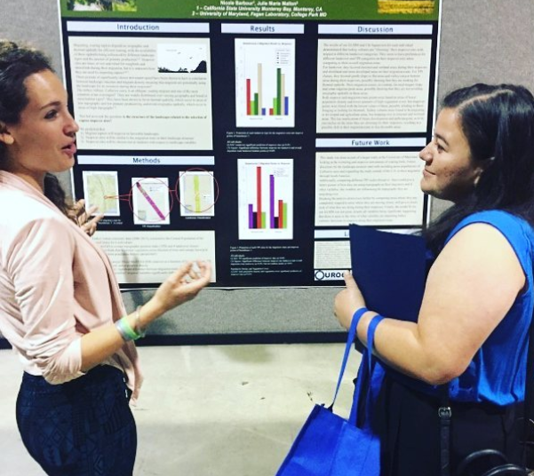

```{r setup, include=FALSE}
knitr::opts_chunk$set(echo = TRUE)
```
{width=75%}

## Publications 

**Barbour N**, Shillinger GL, Gurarie ED, Hoover AL, Gaspar P, Temple-Boyer J, Candela T, Fagan WF, and Bailey H (*in prep*) Incorporating multidimensional behavior into a dynamic management tool for a critically endangered and migratory species. Journal: Conservation Biology

Guthrie A^, **Barbour N^**, Cannon S^, Marriott SE^, Racine P^, Young R^, Bae A, Lester SE, Michaelis A (*in review*) A socio-environmental framework for identifying gaps between among proposed offshore aquaculture development, public perception, and local communities: a Florida case study. Journal: PlosOne ^indicates equal first author status

**Barbour N**, Robillard AJ, Shillinger GL, Lyubchich V, Secor DH, Fagan WF, Bailey H (*in review*) Using machine learning approaches to classify vertical movement profiles and behavior. Journal: Ecosphere

**Barbour N**, Shillinger GL, Hoover HL, Williamson SA, Coles VJ, Liang D, Fagan WF, Bailey H. (2020) Environmental and biological factors influencing dispersal of neonate leatherback turtles (*Dermochelys coriacea*) from an endangered Costa Rican nesting population. Journal: Frontiers in Marine Science

*Link to Published Article*: [link](https://www.frontiersin.org/articles/10.3389/fmars.2020.582933/full?&utm_source=Email_to_authors_&utm_medium=Email&utm_content=T1_11.5e1_author&utm_campaign=Email_publication&field=&journalName=Frontiers_in_Marine_Science&id=582933)
<br>

Degenford, HJ, Liang D, Bailey H, Hoover AL, … **Barbour N**, Shillinger GL  Using fisheries observation data to develop a predictive species distribution model for endangered sea turtles. Journal: Conservation Science and Practice

*Link to Published Article*: [link](https://conbio.onlinelibrary.wiley.com/doi/full/10.1111/csp2.349)
<br>

Gray M, **Barbour N**, Campbell B, Robillard AJ, Todd-Rodriguez A, Xiao H, Plough L (2021) Ecolabels can improve public perception and farm profits for shellfish aquaculture. Journal: Aquaculture Environment Interactions 

*Link to Published Article*: [link](https://archive.hshsl.umaryland.edu/handle/10713/15158)

<br>

<br>

## Recent Presentations

**Barbour N**, (*oral presentation*). Incorporating Multidimensional Behavior into Dynamic Management. Guest Lecturer, Upwell Roundtable 2022.

**Barbour N**. (*oral presentation*). Using Dynamic Time Warp Clustering to Classify Dive Profiles of a Highly Migratory SPecies. Ecology in R Conference 2021.

**Barbour N**. (*oral presentation*). Using RStudio & GitHub for Project Management. Guest Lecturer: University of Maryland, Research Interaction in Teams, 2021.

**Barbour N**. (*workshop series*). Studying Movement Ecology of Sea Turtles through Different Life Stages. Upwell Workhop 2021.

**Barbour N**. (*oral presentation*). Introduction to Marine Mammals. Guest Lecturer: University of Maryland, Mammalogy, 2021. 

**Barbour N**, Bailey H, Hoover HL, Ashley N, Williamson SA, Shillinger GL (*oral presentation*). Environmental and biological drivers of endangered leatherback hatchling (*Dermochelys coriacea*) early dispersal from an endangered Costa Rican nesting population. Conference: Ocean Sciences Meeting 2020. 

**Barbour N**. (*oral presentation*). Tracking live marine animals. Webinar: NASA Endeavor STEM Program 2020. 

**Barbour N**. (*oral presentation*). Learning and Navigation. Guest Lecturer: University of Maryland, Principles of Ecology and Evolution, 2019. 

**Barbour N**. (*oral presentation*). Tracking little dudes in the ocean: leatherback hatchlings in the Caribbean. Guest Speaker: GraduateTerp Exchange 2019.

<br>
