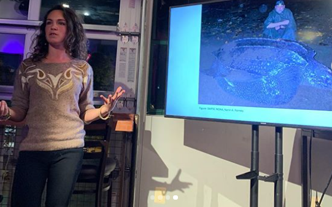

```{r setup, include=FALSE}
knitr::opts_chunk$set(echo = TRUE)
```



### **Graduate Teaching Experience**:
*University of Maryland, Department of Biology*

  * BSCI 160/161: Principles of Ecology and Evolution Laboratory and Lecture
  * BSCI 334/335: Mammalogy Laboratory and Lecture
  * BSCI 170/171: Principles of Molecular and Cellular Biology Laboratory and Lecture
  * BSCI 202/201: Human Anatomy and Physiology II Laboratory and Lecture
  * STAT 689: Research Interaction in Teams, Movement Ecology

<br>

### **External Teaching** (*Lectures*):

  * *Learning and Navigation*. Guest Lecturer: University of Maryland, Principles of Ecology and Evolution. 
  * *Introduction to Marine Mammals*. Guest Lecturer: University of Maryland, Mammalogy.
  * *Using RStudio & GitHub for Project Management*. Guest Lecturer: University of Maryland, Research Interaction in Teams.

<br>

### **Developed Syllabi**:

I teach Mammalogy (BSCI 334/335) in the Spring and as the sole teaching assistant for the course, I have been "revamping" it and developing/updating content. This is reflected in the syllabus written by me below. 

*Soon to come*: I am working on re-creating the TA manual and creating R-markdown documents for student final projects for this course.

{width=75%}